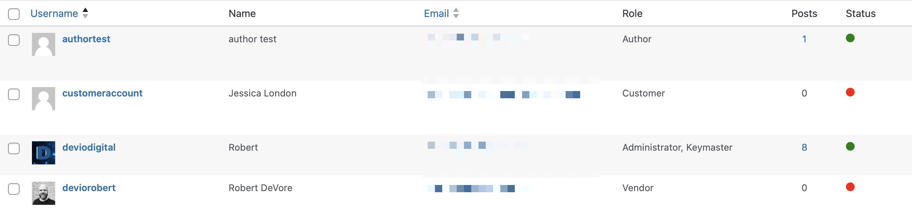
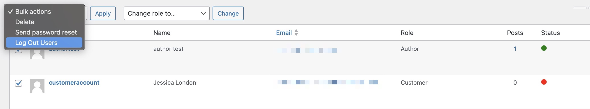

# User Login Status

A WordPress plugin to easily view which users are online/offline and log them out en-masse directly from the Users admin table.

## Description

The **User Login Status** plugin enables administrators to view and manage user login statuses directly from the WordPress admin dashboard. With this plugin, you can easily see which users are logged in or out and, if necessary, log out multiple users at once using the bulk action feature.

### Key Features
- 🟢 **Monitor Login Status**: Quickly see whether a user is logged in or out via color-coded icons (green = online, red = offline) in the Users table.
- 🚪 **Bulk Log Out Users**: Select multiple users and log them out simultaneously using the bulk action dropdown in the Users table.
- 🔄 **Real-Time Updates**: User statuses are updated via AJAX every 30 seconds to reflect real-time login activity.
- 🔒 **Secure AJAX Requests**: The plugin uses nonces to ensure that AJAX requests are secure and valid.

## Installation

### From Your WordPress Dashboard
1. Navigate to **Plugins > Add New**.
2. Search for **User Login Status**.
3. Click **Install Now** and then **Activate**.

### Manual Installation
1. Download the plugin ZIP file from this repository.
2. Upload the ZIP file via the **Plugins > Add New > Upload Plugin** section of your WordPress dashboard.
3. Activate the plugin from the **Plugins** menu.

### Installation via FTP
1. Download the plugin ZIP file and unzip it.
2. Upload the `user-login-status` folder to the `/wp-content/plugins/` directory on your server.
3. Activate the plugin from the **Plugins** menu in WordPress.

## Usage

Once the plugin is activated:
1. Navigate to the **Users** section in your WordPress admin dashboard.
2. You will see a new **Status** column in the Users table:
   - 🟢 **Green Circle**: User is logged in.
   - 🔴 **Red Circle**: User is logged out.
3. To log out multiple users:
   - Check the boxes next to the users you want to log out.
   - Select **Log Out Users** from the bulk actions dropdown.
   - Click **Apply**.

## Technical Details

- **Session Management**: The plugin relies on WordPress’s built-in session tokens to determine whether a user is logged in or out.
- **AJAX Polling**: User statuses are refreshed every 30 seconds via AJAX to provide real-time updates.
- **Security**: All AJAX requests are secured with nonces to prevent unauthorized access.

## Screenshots

1. **User status column**: Shows a green circle for logged-in users and a red circle for logged-out users.
   
   
2. **Bulk log out action**: Select multiple users and log them out from the Users table.
   

## Frequently Asked Questions

### How does the plugin determine whether a user is logged in?
The plugin checks the session tokens stored in the user’s metadata. If session tokens exist and are active, the user is considered logged in.

### Can I adjust how often the user status is refreshed?
Yes, the status is refreshed every 30 seconds by default. If you wish to change the interval, you can modify the polling interval in the JavaScript code.

### Will this plugin work on large websites with many users?
For websites with large numbers of users, the plugin batches AJAX requests to improve performance. This ensures that the plugin remains efficient even when dealing with many users.

## Changelog

### 1.0.0
- Initial release.

## License

This plugin is licensed under the GPLv3 or later. For more information, visit [http://www.gnu.org/licenses/gpl-3.0.html](http://www.gnu.org/licenses/gpl-3.0.html).
